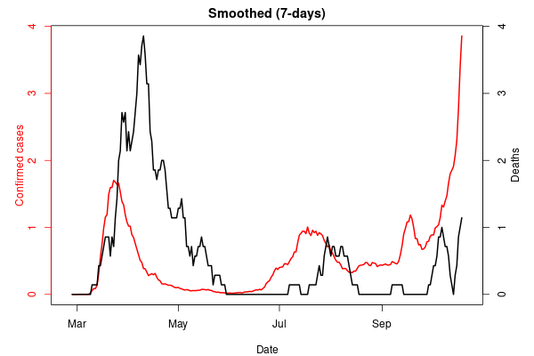
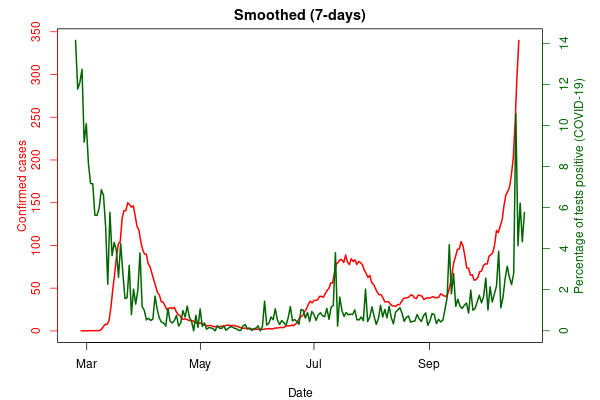

# covid_lux
Data gathering and estimation of total COVID-19 cases in Luxembourg 

# Aim
- [x] Gather structure data for Luxembourg - mainly **daily confirmed cases** and **daily percentage of tests as confirmed cases** 
- [x] Reproduce [this](https://twitter.com/l_perrault/status/1309135525593468929) for Luxembourg, the estimated number of cases in the 'region'. If you aren't familiar with Luxembourg, 1/4 of it's daytime or working population is from outside the country and potentially also being tested by Luxembourg.

# Conclusion
The method doesn't appear to work for smaller numbers of cases - or there's an error with my methodology.

See results below:

# Data source
https://msan.gouvernement.lu/fr/graphiques-evolution.html

# Method
https://www.medrxiv.org/content/10.1101/2020.06.26.20141135v1
